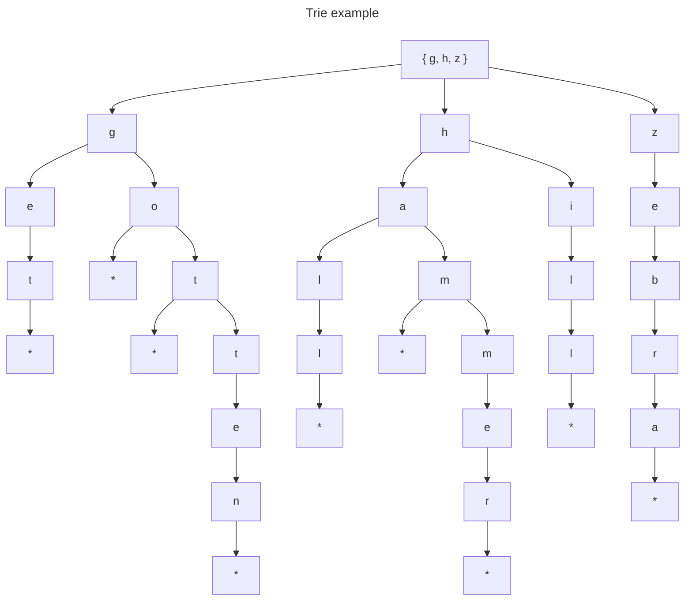

# It doesn't hurt to trie

## Notes

### Tries

- A trie is a collection of nodes that point to other nodes
- It is not a binary tree, as a trie node can have any number of child nodes
- Can be implemented using multiple hash tables
  - A character (such as `*`) can be used to indicate that the end of a word has been reached; this will point to `None` (i.e. there are no further child nodes)
- Search efficiency using hash tables is `O(K)` where `K` is the number of characters in the search string; this is close to constant time, although the number of steps can vary. The efficiency does not depend on the number of nodes, `N`
- Insertion efficiency is also `O(K)` as `K + 1` steps are required (`K` steps as per the search, and one step to indicate the end of the word with `*`)

#### Search

- `currentNode` will point to the root node at the start of the search
- Iterate over each character of the search string
  - Check if `currentNode` has a child with a character as that key
    - If not (search string does not exist) return `None`
    - If it does, update `currentNode` to be that child node and move to next iteration
- At the end of the iteration, the search string has been found

#### Insertion

- `currentNode` will point to the root node at the start of the insertion
- Iterate over each character of the search string
  - Check if `currentNode` has a child with a character as that key
    - If not (search string does not exist) create such a child node and update `currentNode` to be this node and move to next iteration
    - If it does, update `currentNode` to be that child node and move to next iteration
- At the end of the iteration, add a `*` child to indicate that the word is complete

#### Implementation

```python
class TrieNode:
    def __init__(self):
        self.children = {}

class Trie:
    def __init__(self):
        self.root = TrieNode()
    
    def search(self, word):
        currentNode = self.root

        for char in word:
            if currentNode.children.get(char):
                currentNode = currentNode.children[char]
            else:
                return None
        
        return currentNode
    
    def insert(self, word):
        currentNode = self.root

        for char in word:
            if currentNode.children.get(char):
                currentNode = currentNode.children[char]
            else:
                newNode = TrieNode()
                currentNode.children[char] = newNode
                currentNode = newNode
        
        currentNode.children['*'] = None
    
    def collectAllWords(self, node=None, word='', words=[]):
        currentNode = node or self.root

        for key, childNode in currentNode.children.items():
            if key == '*':
                words.append(word)
            else:
                self.collectAllWords(childNode, word + key, words)
        
        return words
    
    def autocomplete(self, prefix):
        currentNode = self.search(prefix)

        if not currentNode:
            return None

        return self.collectAllWords(currentNode)
```

## References

## Exercises (page 329)

### Q1

Words stored in the trie:

- tag
- tan
- tank
- tap
- today
- total
- we
- well
- went

### Q2



### Q3

Write a function that traverses each node of a trie and prints each key.

Starting from the `Trie` code above:

```python
class TrieNode:
    def __init__(self):
        self.children = {}

class Trie:
    def __init__(self):
        self.root = TrieNode()
    
    def search(self, word):
        currentNode = self.root

        for char in word:
            if currentNode.children.get(char):
                currentNode = currentNode.children[char]
            else:
                return None
        
        return currentNode
    
    def insert(self, word):
        currentNode = self.root

        for char in word:
            if currentNode.children.get(char):
                currentNode = currentNode.children[char]
            else:
                newNode = TrieNode()
                currentNode.children[char] = newNode
                currentNode = newNode
        
        currentNode.children['*'] = None
    
    def collectAllWords(self, node=None, word='', words=[]):
        currentNode = node or self.root

        for key, childNode in currentNode.children.items():
            if key == '*':
                words.append(word)
            else:
                self.collectAllWords(childNode, word + key, words)
        
        return words
    
    def autocomplete(self, prefix):
        currentNode = self.search(prefix)

        if not currentNode:
            return None

        return self.collectAllWords(currentNode)
    
    # new code
    def traverse(self, node=None):
        currentNode = node or self.root

        for key, childNode in currentNode.children.items():
            print(key)

            if key != '*':
                traverse(childNode)
```

### Q4

Write an autocorrect function to correct a user's typo.

Starting from the `Trie` code above:

```python
class TrieNode:
    def __init__(self):
        self.children = {}

class Trie:
    def __init__(self):
        self.root = TrieNode()
    
    def search(self, word):
        currentNode = self.root

        for char in word:
            if currentNode.children.get(char):
                currentNode = currentNode.children[char]
            else:
                return None
        
        return currentNode
    
    def insert(self, word):
        currentNode = self.root

        for char in word:
            if currentNode.children.get(char):
                currentNode = currentNode.children[char]
            else:
                newNode = TrieNode()
                currentNode.children[char] = newNode
                currentNode = newNode
        
        currentNode.children['*'] = None
    
    def collectAllWords(self, node=None, word='', words=[]):
        currentNode = node or self.root

        for key, childNode in currentNode.children.items():
            if key == '*':
                words.append(word)
            else:
                self.collectAllWords(childNode, word + key, words)
        
        return words
    
    def autocomplete(self, prefix):
        currentNode = self.search(prefix)

        if not currentNode:
            return None

        return self.collectAllWords(currentNode)
    
    # new code
    def autocorrect(self, word):
        currentNode = self.root
        stringFound = ''

        for char in word:
            if currentNode.children.get(char):
                stringFound += char
                currentNode = currentNode.children[char]
            else:
                return stringFound + self.collectAllWords(currentNode)[0]
        
        return stringFound
```
