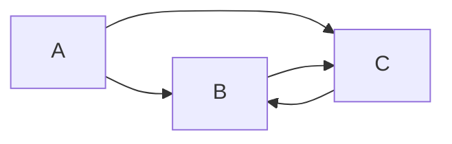
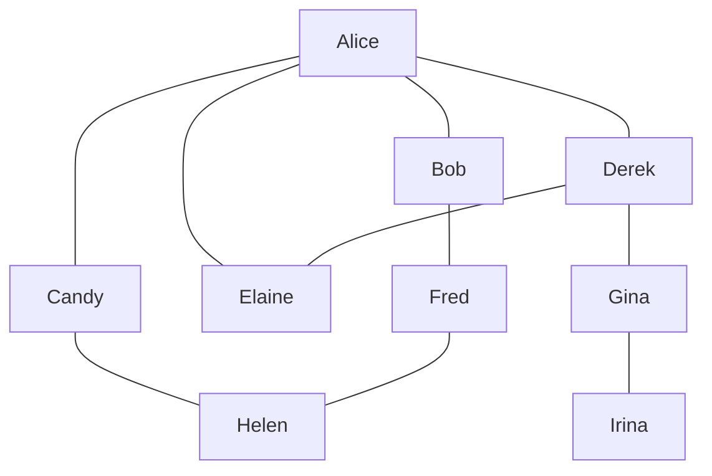
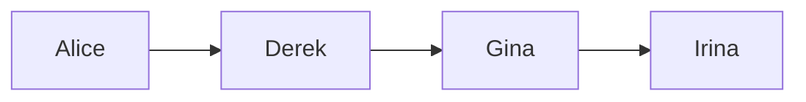
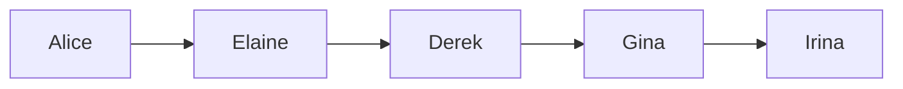
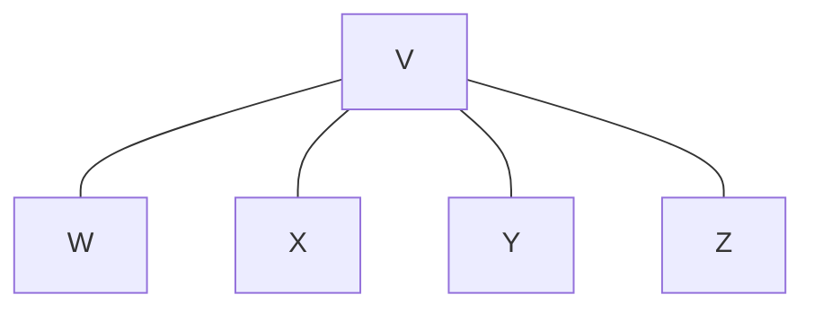

# Connecting everything with graphs

## Notes

### Graphs

- Graphs are data structures
- Trees are a type of graph, but cannot have cycles, and all nodes must be connected
  - A cycle is when nodes reference one another in a circular way, for example: `A - B, B - C, C - A`
  - "All nodes must be connected" means that no nodes can be isolated, shown as `D` in this example: `A - B, B - C, D`
- Graphs have specific terms:
  - *Vertex*: each point on the graph (i.e. a node)
  - *Edge*: a connection between vertices
  - *Adjacent* or *neighbours*: used to describe two vertices connected by an edge
    - Here we see that `A` and `B` are adjacent two one another, as the two vertices share an edge: `A - B, B - C, C - A`
  - *Connected graph*: a graph where all of the vertices are connected in some way
- Simple graphs can be represented as hashtables

### Directed graphs

Relationships may not be mutual (for example, following on social networks):



This can be represented in a hashtable. We use arrays to show a list of people each person follows:

```ruby
followees = {
  "Alice" => ["Bob", "Cynthia"],
  "Bob" => ["Cynthia"],
  "Cynthia" => ["Bob"]
}
```

### Object-oriented graph implementation

Each vertex represents a person (the value might be the name, for example). The following is a directed graph (friendships are not mutual) representing the diagram above.

```ruby
class Vertex
  attr_accessor :value, :adjacent_vertices

  def initialize(value)
    @value = value
    @adjacent_vertices = []
  end

  def add_adjacent_vertex(vertex)
    @adjacent_vertices << vertex
  end
end

alice = Vertex.new("alice")
bob = Vertex.new("bob")
cynthia = Vertex.new("cynthia")

alice.add_adjacent_vertex(bob)
alice.add_adjacent_vertex(cynthia)
bob.add_adjacent_vertex(cynthia)
cynthia.add_adjacent_vertex(bob)
```

For an undirected graph where friendships are mutual, the `add_adjacent_vertex` function needs to be called on both vertices (people) to ensure that they exist in each other's list of friends.

```ruby
def add_adjacent_vertex(vertex)
  # Prevent infinite loop by checking whether the vertex has been added
  return if adjacent_vertices.include?(vertex)
  @adjacent_vertices << vertex
  vertex.add_adjacent_vertex(self)
end
```

When dealing with disconnected graphs, it may be necessary to store all of the vertices in an array or other data structure for easy access.

### Adjacency lists and adjacency matrices

The implementation above uses an adjacency list. An adjacency matrix can also be used, and this employs a 2D array.

### Graph search

- *Search* in the context of graphs means to find a *path* from one vertex to a given vertex.
- This can be useful for finding any vertex within a connected graph
- Graph search can also show whether two vertices are connected or not
- It can also be used for graph traversal



The *path* is the specific sequence of edges to get from one vertex to another.

The shortest path is:



The longer path is:



### Depth-first search

The *depth-first search* (DFS) is recursive. The algorithm is:

1. Start at any vertex in the graph
2. Add the current vertex to the hashtable (which records all visited vertices)
3. Iterate through the adjacent vertices of the current vertex
   1. If the adjacent vertex has already been visited, ignore it (this prevents an infinite loop when the graph has cycles)
   2. If the adjacent vertex has not already been visited, perform a depth-first search on it

#### Code implementation: traversal

```ruby
def dfs_traverse(vertex, visited_vertices={})
  # Mark vertex as visited by adding to hashtable
  visited_vertices[vertex.value] = true

  # Print vertex's value for debugging
  puts vertex.value

  # Iterate through adjacent vertices
  vertex.adjacent_vertices.each do |adjacent_vertex|
    # Ignore if already visited
    next if visited_vertices[adjacent_vertex.value]

    # Recursively traverse if not already visited
    dfs_traverse(adjacent_vertex, visited_vertices)
  end
end
```

#### Code implementation: search for a specific vertex

```ruby
def dfs(vertex, search_value, visited_vertices={})
  # Return original vertex if it matches the search_value
  return vertex if vertex.value == search_value

  # Mark vertex as visited by adding to hashtable
  visited_vertices[vertex.value] = true

  # Iterate through adjacent vertices
  vertex.adjacent_vertices.each do |adjacent_vertex|
    # Ignore if already visited
    next if visited_vertices[adjacent_vertex.value]

    # If adjacent vertex matches search_value, return it
    return adjacent_vertex if adjacent_vertex.value == search_value

    # Recursively search for vertex
    vertex_to_find = dfs(adjacent_vertex, search_value visited_vertices)

    # If vertex was found using the above recursion, return it
    return vertex_to_find if vertex_to_find
  end

  # Return nothing if search_value is not found
  return nil
end
```

### Breadth-first search

The *breath-first search* (BFS) uses a queue (a FIFO data structure) and is **not** recursive. The algorithm is:

1. Start at any vertex in the graph (the starting vertex)
2. Add the starting vertex to the hashtable (which records all visited vertices)
3. Add the starting vertex to a queue
4. Start a loop that runs while the queue isn't empty
   1. Within this loop, remove the first vertex from the queue (the current vertex)
   2. Iterate over all of the adjacent vertices of the current vertex
      1. If the adjacent vertex has already been visited, ignore it
      2. If the adjacent vertex has not already been visited, mark it as visited (add to the hashtable) and to the queue
5. Repeat until the queue is empty

#### Code implementation: traversal

```ruby
def bfs_traverse(starting_vertex)
  queue = Queue.new

  visited_vertices = {}
  visited_vertices[starting_vertex.value] = true
  queue.enqueue(starting_vertex)

  # While queue is not empty
  while queue.read
    # Remove first vertex, make it current_vertex
    current_vertex = queue.dequeue

    # Print current_vertex value
    puts current_vertex.value

    # Iterate over adjacent vertices
    current_vertex.adjacent_vertices.each do |adjacent_vertex|
      # If adjacent_vertex has not yet been visited
      if !visited_vertices[adjacent_vertex.value]
        # Mark adjacent_vertex as visited
        visited_vertices[adjacent_vertex.value] = true

        # Add adjacent vertex to queue
        queue.enqueue(adjacent_vertex)
      end
    end
  end
end
```

### DFS vs BFS

- DFS will go as far away as possible before returning
- BFS will start with immediate connections and then spiral out
- Choosing the right graph search can find the vertex being searched for sooner in some cases

### Efficiency of graph search

- Efficiency depends on the number of vertices, *V* and edges, *E*, in the graph
- Graph search has a time complexity of `O(V + E)` - but *E* only counts the number of edges once, whereas in reality they can be touched more than once

In the example below, the number of steps is:

- 5 vertices
- V: 4 neighbours
- W: 1 neighbour
- X: 1 neighbour
- Y: 1 neighbour
- Z: 1 neighbour
  
Total: `5 + 8 = 13`.



## References

## Exercises (page 384)

### Q1

### Q2

### Q3

### Q4

### Q5
